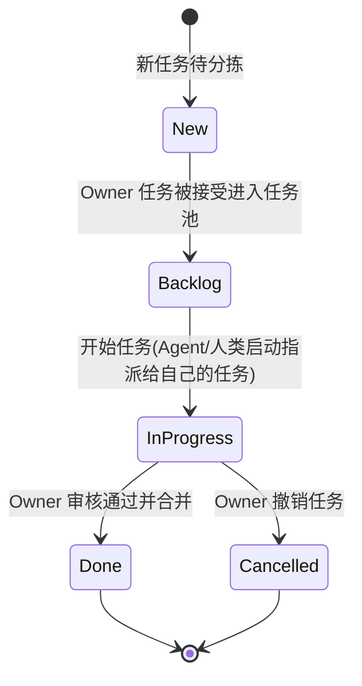
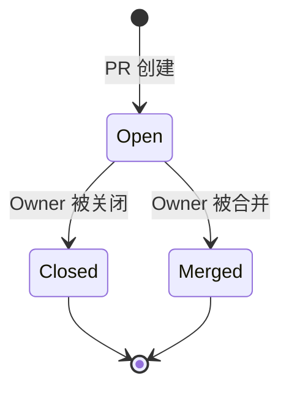

# AI 工作流（V1，简化落地版）

## 目标与范围

本版本只解决一件事：**先把“Owner 分配任务 -> Agent 开发 -> PR 审核 -> 完成/撤销”跑通**。  
暂不引入复杂编排、多 Agent、自动风险分级、安全审计与成本治理。

---

## 角色与职责

- Owner（项目所有者）
  - 创建与维护 Issue/Project 任务。
  - 指派任务给 Agent 用户或其他开发者。
  - 审核 PR，并做出：通过合并 / 打回修改 / 撤销关闭 的决定。
- Agent（特殊 agent 用户）
  - 接收被指派任务后，在 devcontainer 中创建 issue 分支。
  - 完成开发、测试、提交与 PR 创建。
  - 根据 Review 意见继续迭代，直到通过或被撤销。

---

## 状态机

### ISSUE 状态机

> 说明：该图仅用于降低阅读复杂度，语义与github实际issue状态完全一致。

### PR 状态机

### 状态机规则

- PR 状态机和Issue状态机分离。
- 当Issue状态为 `InProgress` 时，Agent 领取分配给自己的任务进行开发.
- PR 状态机和ISSUE 状态机联动:
  - 当PR状态为 `Open` 时，Issue状态会自动变为 `InProgress`。
  - 当PR状态为 `Merged` 时，Issue状态会自动变为 `Done`。
  - 当PR状态为 `Closed` 时，Issue状态会自动变为 `Cancelled`。
- Agent暂停开发求助讨论不改变Issue和PR状态机。

---

## 后续目标,非V1目标,刻意不做

v1跑通后再考虑以下目标:

- 事件驱动：基于 GitHub Webhook 实现事件触发。
- 多 Agent 协作编排。
- 自动风险分级与审批流。
- 安全审计、权限细分、成本熔断。
- 自动发布与复杂可观测平台。
- 预算管理：监控成本，防止超出预算。
- 任务模版
- 复杂任务拆分为多个子 Issue的职责分配
- Agent 在不确定时主动提问，而非猜测
- 任务复盘报告、Prompt 优化建议、知识沉淀
- 可观侧性: 指标、日志、监控、告警
- 实现失败处理优化